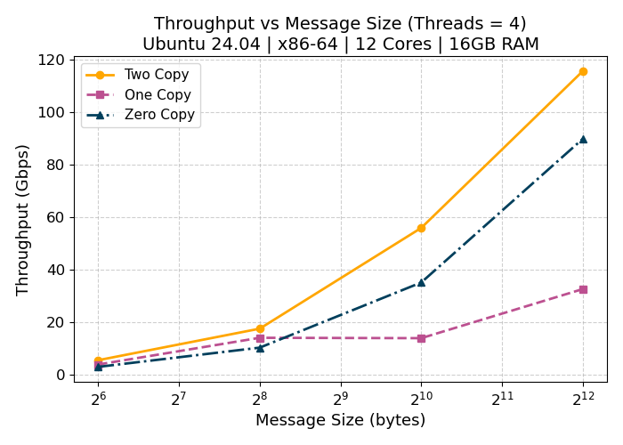
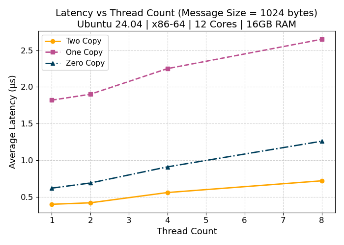
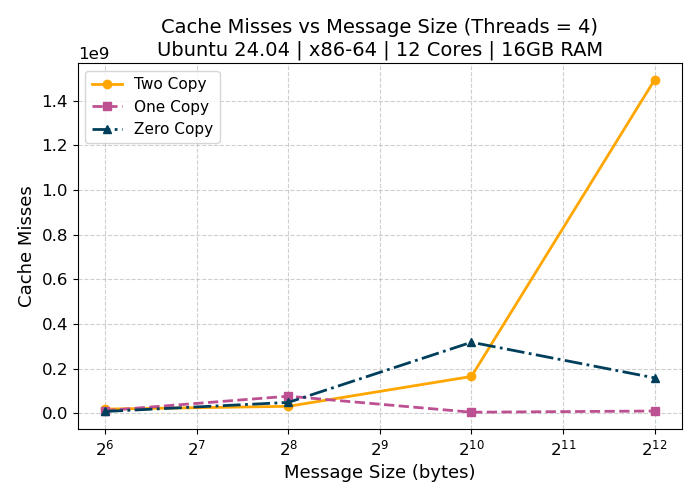
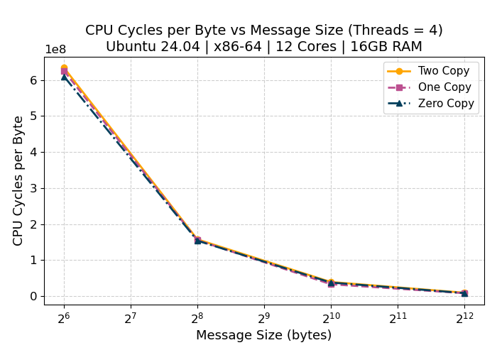

# 🌐 GRS PA02 – Analysis of Network I/O Primitives  
**Course:** Graduate Systems (CSE638)  

**Assignment:** PA02 – Analysis of Network I/O Primitives using "perf" tool

**Roll Number:** MT25070  

---

## 📌 Assignment Objective

The objective of this assignment is to **experimentally study the cost of data movement in TCP-based network I/O** by implementing and comparing different socket communication mechanisms.

The assignment focuses on understanding:
- How data moves between **user space and kernel space**
- The overhead introduced by **memory copies**
- The impact of **zero-copy optimizations** on CPU usage and cache behavior
- Performance trade-offs between **throughput, latency, and CPU efficiency**

Three different socket communication models are implemented and analyzed:
- Two-copy (baseline)
- One-copy (scatter–gather I/O)
- Zero-copy (kernel-assisted DMA)

---

## 🧩 Assignment Breakdown

The assignment consists of **four major parts**:

| Part | Description |
|----|----|
| **Part A** | Multithreaded client–server implementations using different socket primitives |
| **Part B** | Profiling and measurement of throughput, latency, and micro-architectural metrics |
| **Part C** | Fully automated experiment execution and CSV data collection |
| **Part D** | Plotting and visualization of experimental results |

---

## 📂 Folder Structure

All files are placed in a **single directory**, as per assignment constraints.  
No subfolders are used.

~~~text
MT25070_PA02/
├── MT25070_Part_A_Message.h
├── MT25070_Part_A1_Server.c
├── MT25070_Part_A1_Client.c
├── MT25070_Part_A2_Server.c
├── MT25070_Part_A2_Client.c
├── MT25070_Part_A3_Server.c
├── MT25070_Part_A3_Client.c
├── MT25070_Part_C_shell.sh
├── MT25070_Part_C_AllResults.csv
├── MT25070_Part_D_Plots.py
├── Makefile
├── Readme.md
~~~

## 🧪 Part A – Multithreaded Socket Implementations

Part A implements **three TCP-based client–server programs**, all following a common design:
- Server accepts multiple concurrent clients
- One thread per client
- Fixed-size messages sent repeatedly
- Message consists of **8 dynamically allocated fields**
- Heap-allocated buffers are used

### 🔹 Common Message Structure

File: 
~~~text
MT25070_Part_A_Message.h
~~~

This header defines:
- A message structure with **8 dynamically allocated fields**
- Helper functions to create and destroy messages
- Used by all server implementations (A1, A2, A3)

---

### 🔹 Part A.1 – Two-Copy Implementation (Baseline)

**Files:**
~~~text
MT25070_Part_A1_Server.c
MT25070_Part_A1_Client.c
~~~

**Implementation:**
- Uses standard `send()` and `recv()` socket calls
- Data is copied:
  - From user space → kernel space (send)
  - From kernel space → user space (recv)
- Represents the baseline TCP data path

**Execution Commands:**
```bash
sudo ip netns exec ns_server ./MT25070_A1_Server <port> <message_size>
sudo ip netns exec ns_client ./MT25070_A1_Client <server_ip> <port> <message_size> <threads> <duration>
```
---

### 🔹 Part A.2 – One-Copy Optimized Implementation

**Files:**
~~~text
MT25070_Part_A2_Server.c
MT25070_Part_A2_Client.c
~~~

**Implementation:**
- Uses `sendmsg()` with iovec (scatter–gather I/O)
- Multiple buffers are passed directly to the kernel
- Eliminates extra user-space buffer packing
- User → kernel copy still exists

**Key Benefit:**
- Reduces application-level memory copying

---

### 🔹 Part A.3 – Zero-Copy Implementation

**Files:**
~~~text
MT25070_Part_A3_Server.c
MT25070_Part_A3_Client.c
~~~

**Implementation:**

- Uses sendmsg() with MSG_ZEROCOPY
- Kernel pins user-space memory pages
- NIC reads data directly via DMA
- Completion is handled via the socket error queue

**Key Benefit:**

- Eliminates user → kernel data copy
- Reduces CPU usage and cache pollution

---

## 📊 Part B – Profiling and Measurement

Part B measures both application-level and micro-architectural metrics.

- Metrics Collected:
  - Throughput (Gbps) – application-level
  - Average Latency (µs) – application-level
  - CPU cycles – ``perf stat``
  - Cache misses (L1 + LLC) – ``perf stat``
  - Context switches – ``perf stat``

- Experimental Parameters:
  - Message sizes: **64, 256, 1024, 4096 bytes**
  - Thread counts: **1, 2, 4, 8**

All measurements are collected automatically during client execution.

---

## ⚙️ Part C – Automated Experiment Script

**File:**
~~~text
MT25070_Part_C_shell.sh
~~~

- This Bash script:
  - Compiles all implementations
  - Runs experiments across all message sizes and thread counts
  - Uses perf stat to collect hardware counters
  - Stores all results in a single CSV file

**CSV Output:**
~~~text
MT25070_Part_C_AllResults.csv
~~~

**Run Commands:**
```bash
chmod +x MT25070_Part_C_shell.sh
./MT25070_Part_C_shell.sh
```
Once started, the script runs without any manual intervention.

---

## 📈 Part D – Plotting and Visualization

**File:**
~~~text
MT25070_Part_D_Plots.py
~~~

- Plots are generated using matplotlib
- Values are hardcoded as required
- CSV files are NOT read for plotting

**Four plots are generated:**
#### 1️⃣ Throughput vs Message Size

This plot shows how throughput changes with increasing message size for all
three implementations.


#### 2️⃣ Latency vs Thread Count

This plot illustrates the effect of increasing thread count on average message
latency.


#### 3️⃣ Cache Misses vs Message Size

This plot highlights cache behavior as message size increases, showing how
data movement affects cache efficiency.


#### 4️⃣ CPU Cycles per Byte

This plot compares the CPU cost per byte transferred across implementations.


**Run Command:**
```bash
python3 MT25070_Part_D_Plots.py
```
---

## 🛠️ Build Instructions (From Scratch)
1️⃣ Compile All Programs
```bash
make clean
make
```

2️⃣ Create Network Namespaces
```bash
sudo ip netns add ns_server
sudo ip netns add ns_client
```

3️⃣ Create Virtual Ethernet Pair
```bash
sudo ip link add veth_server type veth peer name veth_client
sudo ip link set veth_server netns ns_server
sudo ip link set veth_client netns ns_client
```

4️⃣ Assign IP Addresses
```bash
sudo ip netns exec ns_server ip addr add 10.0.0.1/24 dev veth_server
sudo ip netns exec ns_client ip addr add 10.0.0.2/24 dev veth_client
sudo ip netns exec ns_server ip link set veth_server up
sudo ip netns exec ns_client ip link set veth_client up
sudo ip netns exec ns_server ip link set lo up
sudo ip netns exec ns_client ip link set lo up
```

5️⃣ Verify Connectivity
```bash
sudo ip netns exec ns_client ping 10.0.0.1
```
